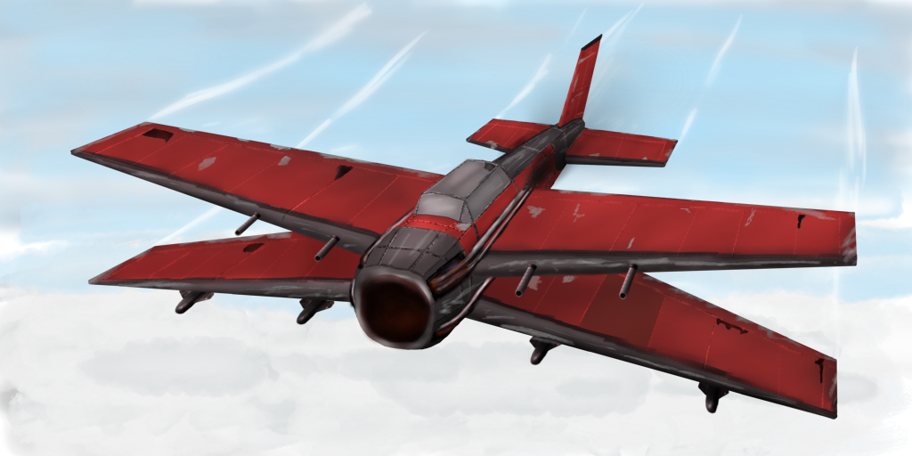

# Concept

Project Daredevil is an aerial combat game heavily inspired by *Ace Combat* and *Crimson Skies*.
It features an *arcady* aerodynamic flight model giving the player superhuman capabilities controlling one's aircraft.
Combat revolves around dogfights with a balanced focus on use of guns and homing missiles.

Alternate World War 2 history serves as base setting for the game;
however, there are no limitations on how farfetched scenarios can get.
Steampunk, fantasy, sci-fi… is fine.
Similar to Ace Combat, presentation is hyper-realistic and over the top.
Unrealistic visual effects and anime-like drama should be omnipresent.
Maybe have a look at [this trailer](https://www.youtube.com/watch?v=ReHVAlEU3UQ) for further reference.

The game is a single player experience, fighting AI combatants.
A Xbox One controller is used to control the plane, viewed from 3rd person.

This and the following documents elaborate the base concept for Project Daredevil.
Everything is subject to change and exceptions are welcome.

## Music

A combination of orchestral and rock should be fine.
[Ace Combat 7 OST](https://www.youtube.com/watch?v=7Yvb_AwCO_U&list=PLLrug9JZTq60aXKII6oDrf1NLndUKWM_X&index=41) provides a lot of inspiration.
Also [anime battle music](https://www.youtube.com/watch?v=pppp6Jzuc3A) would be a good fit.

## Other

- [Flight Model](FlightModel.md)
- [Camera](Camera.md)
- [Combat](Combat.md)
- [HUD](HUD.md)
- [Terrain](Terrain.md)
- [Effects](Effects.md)
- [AI](AI.md)

- - -

