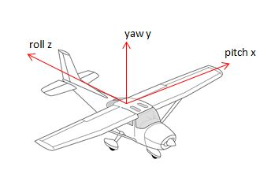

# Flight Model

We start off with a very basic aerodynamic flight model that loosely models thrust, lift, drag, and gravity.
The player controls yaw, pitch, and roll of the plane.

Typically yawing is substantially slower than pitching and rolling.
Also, pitching upwards is typically faster than pitching downwards.
The faster a plane goes, the less manurable it becomes.

A certain minimum amount of speed is required to keep the plane flying.
Undercutting this minimum throws the plane into a stall.
While stalling, the player has no control over yaw, pitch, and roll.
Stall continues until the minimum flight speed is re-acquired; or the plane crashes.

Each plane also features a maximum speed limit that can never be exceeded, not even by flying straight downwards.

Mappings:
  - Right trigger: accelerate
  - Left trigger: decelerate
  - Left / right shoulder buttons: yaw
  - Left stick x-axes: roll
  - Left stick y-axes: pitch

## Focus Mode

Focus mode pulls the camera closer to the crosshair, narrowing the field of view.
Left stick x-axes controls the plane's yaw while in focus mode.
This allows fine adjustment of the crosshair, commonly needed in dogfights while chasing an enemy.

Mapping:
  - Left + right shoulder buttons

## Strafe Mode

While Ace Combat features *high-G turns* we have strafe mode.
Strafe mode works similar to *uncoupled mode* in space combat games.

When strafe mode is engaged the player can spin the plane around it's own axes without changing the velocity vector's direction.
Drag and gravity still impact velocity, but only it's magnitude.

When disengaging strafe mode, the plane snaps back to it's current velocity vector if that rotation is < 90°.
Otherwise the plane is send into a stall.

Mapping:
  - Left + right triggers
